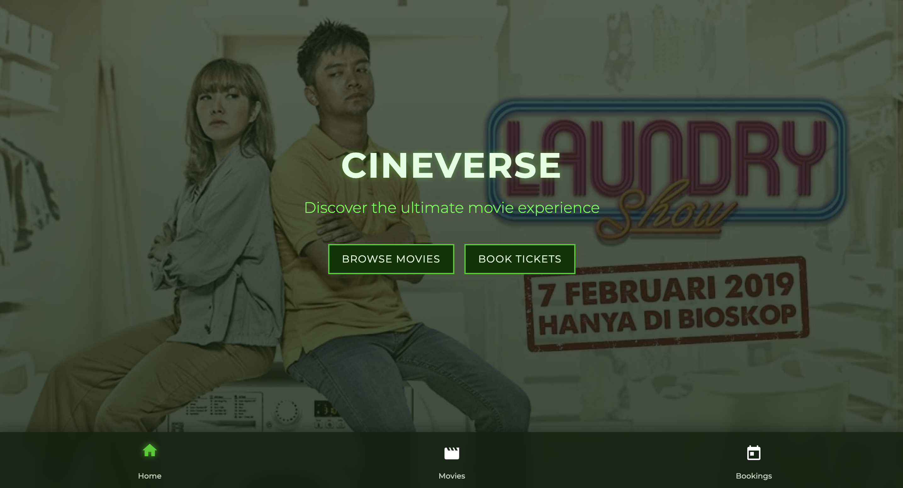
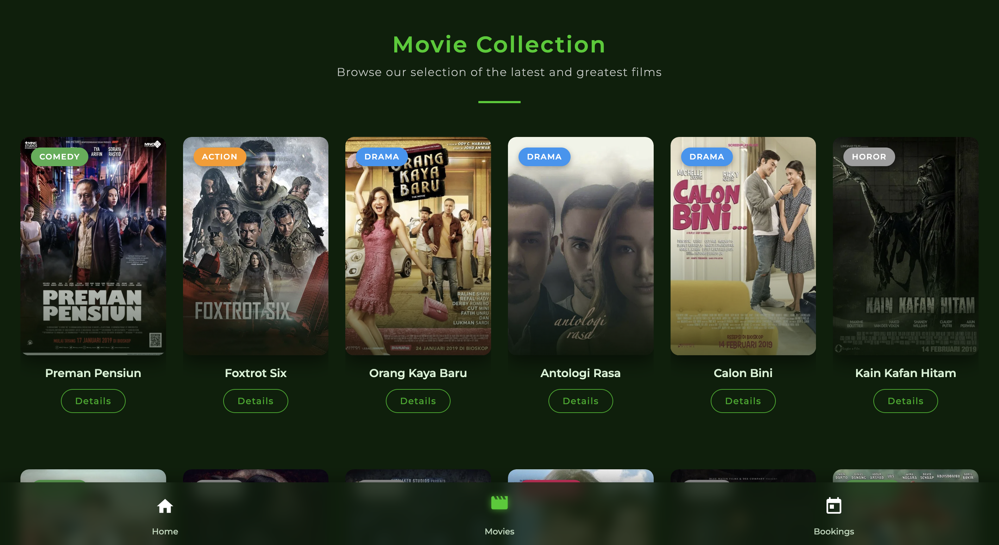
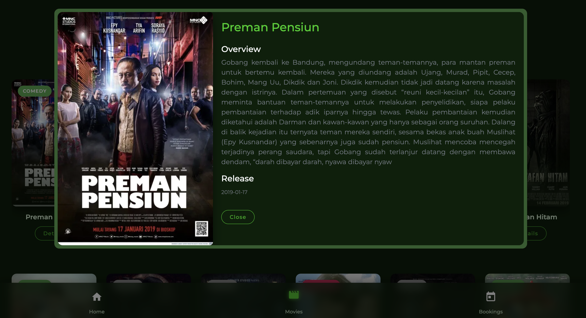
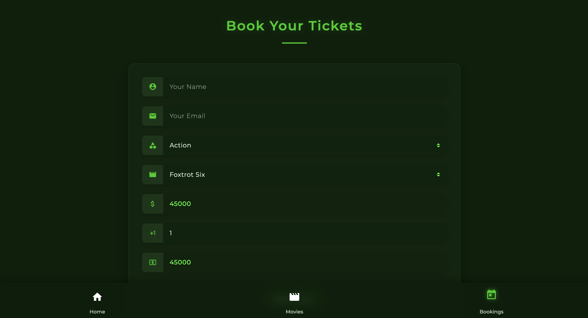

# CineVerse - Movie Collection Website

## Overview
CineVerse is a responsive movie collection website built as the final project for the Hacktiv8 FB DevC JavaScript Program. The application features a minimalist and elegant dark green theme, allowing users to browse movies, view details, and book tickets.

## Features
- Browse movie collections by genre
- View detailed information about each movie
- Book movie tickets with an interactive form
- Responsive design that works on mobile, tablet, and desktop devices
- Elegant animations and transitions for enhanced user experience

## Screenshots

### Home Page


### Movie Collection


### Movie Detail


### Booking Page


## Technology Stack
- HTML5
- CSS3
- JavaScript
- jQuery
- Bootstrap 4

## Data Source
The movie data used in this project is sourced from The Movie Database (TMDB). The data is stored locally in the project's database files for demonstration purposes.

## Color Scheme
The website implements a dark green and black color scheme for a modern, elegant look.

### Color Variables
The color scheme is centralized in `styles/color-res.css` using CSS variables:

```css
:root {
  --primary-dark: #0a1f0a;     /* Very dark green, almost black */
  --primary: #1a3a1a;          /* Dark green */
  --primary-light: #2d5c2d;    /* Medium dark green */
  --secondary-dark: #003300;   /* Dark forest green */
  --secondary: #00cc00;        /* Bright green */
  --secondary-light: #33ff33;  /* Light green */
  --text-light: #e0ffe0;       /* Light green text */
  --text-dark: #121212;        /* Almost black text */
  --accent: #00ff00;           /* Bright accent green */
}
```

### Usage
The website uses consistent CSS classes to apply the color scheme:

#### Background Colors
- `.color-primary` - Dark green background
- `.color-primary-light` - Medium dark green background
- `.color-primary-dark` - Very dark green background
- `.color-secondary` - Bright green background
- `.color-secondary-light` - Light green background
- `.color-secondary-dark` - Dark forest green background

#### Text Colors
- `.font-secondary-light` - Light green text
- `.font-secondary-dark` - Dark forest green text
- `.font-secondary` - Bright green text
- `.font-primary-light` - Medium dark green text
- `.font-primary` - Dark green text
- `.font-primary-dark` - Very dark green text
- `.font-light` - Light green text for readability
- `.font-dark` - Almost black text
- `.font-accent` - Bright accent green text

## Project Structure
- `/pages` - HTML pages for different sections of the website
- `/styles` - CSS stylesheets for styling the website
- `/scripts` - JavaScript files for website functionality
- `/components` - Reusable components like the navigation bar
- `/db` - Local database files containing movie information
- `/screenshots` - Screenshots of the website

## Setup and Installation
1. Clone the repository
2. Open `index.html` in your browser to view the website
3. No build process or server setup required as this is a static website

## Customization
To modify the color scheme, simply update the CSS variables in the `:root` selector in `styles/color-res.css`. All elements using these classes will automatically reflect the changes.

## Code Review with Amazon Q Developer CLI

To perform an automated code review using Amazon Q Developer CLI:

1. Make sure you are on your feature branch with the code changes you want to review (e.g., hotfix, develop, or any other branch).

2. Open your terminal.

3. Launch Amazon Q Chat by running the command:
   ```
   q chat
   ```

4. In the Amazon Q Chat interface, enter the following command:
   ```
   Read prompt.md file and execute it
   ```

5. Wait for the process to complete. When prompted to allow actions, type `t` (trust).

6. Once finished, a comprehensive code review will be generated in a new file called `code-review-result.md` in your project directory.

The review will include:
- Summary of changes
- Identified issues (critical and code quality)
- Recommendations for improvement
- Example code snippets
- Conclusion with overall evaluation

## Credits
- Movie data provided by [The Movie Database (TMDB)](https://www.themoviedb.org/)
- Icons from [Material Icons](https://material.io/resources/icons/)
- Fonts from [Google Fonts](https://fonts.google.com/)